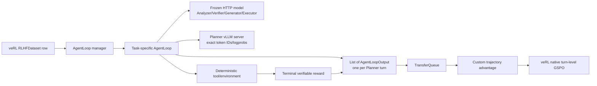
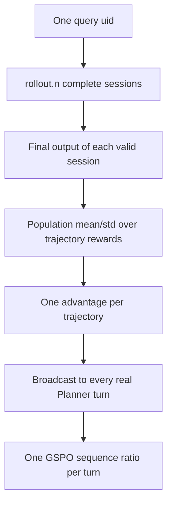

# Architecture

## Runtime ownership



veRL owns Ray scheduling, FSDP, the colocated Planner rollout server,
TransferQueue, actor log-probability computation, GSPO loss, optimizer,
checkpointing, validation, and native logging. The project customizes only the
task AgentLoops and the two semantic mismatches in `PPOTrainer`.

## Task flows

Every task is a plugin over the same AgentFlow control contract:

```text
Frozen Query Analyzer -> trainable Planner -> frozen Executor -> task tool/environment
  -> append-only shared Memory -> frozen Verifier -> next turn or STOP
  -> frozen Generator -> deterministic terminal evaluator
```

Task plugins own their action schema, tools, environment state, role prompts,
step budget, and terminal evaluator. `AgentFlowLoopBase` owns frozen-role calls,
exact Planner rollout capture, prompt-budgeted role views, blocking-backend
offload, and conversion to `AgentLoopOutput`. The veRL Trainer therefore remains
unchanged when a task plugin is added.

Ticket creates a fresh in-memory environment for every rollout session:

```text
Frozen Query Analyzer
  -> Planner
  -> Frozen Executor
  -> direct: Update -> Verifier -> Finish -> Verifier STOP
  -> indirect: Query -> Verifier -> Update returned ticket_id -> Verifier
              -> Finish -> Verifier STOP
  -> Frozen Generator
  -> deterministic binary verifier
```

`Ticket_Finish_Tool` records a domain-level completion submission. It has no
control-flow authority; the frozen Verifier alone selects STOP or CONTINUE.
`Base_Generator_Tool` is available for a bounded supporting analysis action.

GSM8K retains the shared system prompt, legacy Planner/Executor output parsers,
and reviewed task evaluator while using the common role and Memory contract:

```text
Frozen Query Analyzer
  -> Planner
  -> frozen Executor in formal runs, deterministic dispatch in smoke
  -> Calculator or Base Generator
  -> Frozen Verifier
  -> append tool result and judgement to shared Memory
  -> Frozen direct Generator
  -> numeric-match binary reward
```

Formal GSM8K configs use `legacy_llm`; smoke uses deterministic execution.

DeepResearch uses the shared role loop with retrieval actions:

```text
Frozen Query Analyzer -> Planner -> Frozen Executor -> Search/Read/Base Generator
  -> shared Memory -> Frozen Verifier -> Frozen Generator
  -> terminal answer/supporting-fact joint F1
```

Hotpot distractor rows use their attached context documents. Hotpot FullWiki
uses the official introductory-Wikipedia Lucene index, and 2Wiki uses a
separate Lucene index built from the benchmark's complete supplied contexts.
Read actions return up to 20 sentences by default and preserve global sentence
IDs; the Planner can request later pages with `start_sentence`.
The benchmark answer/supporting-fact joint F1 remains the reward. Additional
citation-grounding metrics report whether each generated citation appeared in
an executed Read result, keeping retrieval behavior auditable under the
outcome-only objective.

Coding uses the shared role loop with an isolated Python environment:

```text
Frozen Query Analyzer -> Planner -> Frozen Executor -> Write/Run Tests/Base Generator
  -> shared Memory -> Frozen Verifier -> Frozen Generator
  -> terminal hidden-test pass rate
```

Only public tests enter trajectory memory. Hidden tests remain inside terminal
evaluation.

## Planner token contract

Every Planner call applies the tokenizer chat template once and sends those
exact prompt IDs to veRL's `LLMServerClient.generate()`. The output records:

- exact prompt IDs;
- exact generated response IDs, including EOS when emitted;
- one response-mask value per generated Planner token;
- rollout-engine response log-probabilities.

Frozen-role text is never inserted into a Planner response mask. It therefore
cannot receive Planner gradients.

One complete trajectory returns a list of outputs:

```text
uid_0_0 = Planner turn 0
uid_0_1 = Planner turn 1
uid_0_2 = Planner turn 2, final trajectory reward
```

veRL copies the final reward to earlier turn rows during queue post-processing.
The custom advantage code deliberately selects only the highest turn index in
each session, so that copy cannot cause repeated reward entries in mean/std.

## Reward and advantage hierarchy



For valid trajectories in one query group:

```text
A_i = (R_i - mean(R)) / population_std(R)
```

Infrastructure-invalid sessions are excluded. A group with fewer than two
valid sessions or population std below epsilon receives zero advantage. Model
failures remain valid binary-zero samples.

## GSPO and likelihood consistency

veRL's native GSPO sees one row per Planner turn and computes a length-normalized
sequence importance ratio. GSM8K/Ticket retain low/high clips `0.001/0.003`;
DeepResearch/Coding use `0.0003/0.0004`.

GSM8K/Ticket Planner rollout uses temperature `1.2`; DeepResearch/Coding uses
temperature `1.0`. Every task uses top-p `1.0` and disabled top-k. Before actor
updates, veRL re-computes proximal `old_log_probs` on the saved token IDs and
passes the task's rollout temperature to the FSDP engine. Saved rollout
log-probabilities remain available for veRL diagnostics.

Dynamic metadata sets the global batch to the actual flattened turn count.
GSM8K/Ticket retain their reviewed actor settings. DeepResearch/Coding use one
actor epoch and an eight-row Planner-turn mini-batch, with a one-row per-GPU
micro-batch.

Memory remains append-only for trajectory audit. Every task uses the shared
`MemoryStore`; each role receives a deterministic bounded projection after
space is reserved for its system prompt, question, proposed action, and current
task artifact. Coding retains every complete code revision and binds public-test
results to a code revision and SHA-256. DeepResearch prioritizes the latest
sentence-level Read evidence. Ticket prioritizes the latest visible ticket
state. GSM8K prioritizes the latest executed arithmetic result.

The role projections follow the original AgentFlow responsibility split:

| Role | Memory input |
|---|---|
| Planner | query analysis, budgeted executed-tool history, verifier judgements, and guaranteed latest task state |
| Executor | proposed Planner action, query analysis, latest task state, latest result, and latest judgement |
| Verifier | query analysis, executed tool evidence, current state, and prior judgements |
| Generator | query, module outputs, complete tool evidence, judgements, and current code for Coding |

Verifier is the sole learned module that ends every role loop. Step and time
budgets provide deterministic safety limits. Generator then composes the final
task output from accumulated module state, and the terminal evaluator produces
the only reward used by training.

## GPU topology

```text
GPU0: frozen vLLM OpenAI server
GPU1: Ray-visible veRL actor + Planner rollout
```

The veRL process is launched with `CUDA_VISIBLE_DEVICES=1`; inside that process
GPU1 is remapped to local device 0. Frozen calls go to `127.0.0.1:8000` and do
not allocate a frozen-model copy in each Ray worker.
