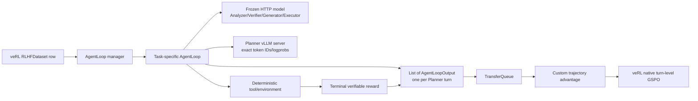
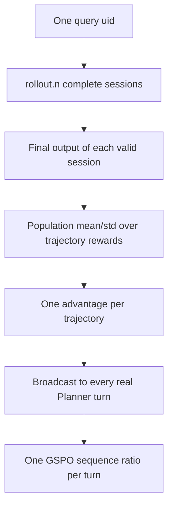

# Architecture

## Runtime ownership



veRL owns Ray scheduling, FSDP, the colocated Planner rollout server,
TransferQueue, actor log-probability computation, GSPO loss, optimizer,
checkpointing, validation, and native logging. The project customizes only the
task AgentLoops and the two semantic mismatches in `PPOTrainer`.

## Task flows

Ticket creates a fresh in-memory environment for every rollout session:

```text
Frozen Query Analyzer
  -> Planner
  -> direct: Update -> Finish
  -> indirect: Query -> Update returned ticket_id -> Finish
  -> deterministic binary verifier
```

GSM8K preserves the reviewed role prompts and memory shape:

```text
Frozen Query Analyzer
  -> Planner
  -> legacy_llm Executor or deterministic expression dispatch
  -> Calculator
  -> Frozen Verifier
  -> write response to Action Step N.judge
  -> next Planner sees that judge
  -> Frozen direct Generator
  -> numeric-match binary reward
```

Formal GSM8K configs use `legacy_llm`; smoke uses deterministic execution.

DeepResearch uses the shared role loop with retrieval actions:

```text
Frozen Query Analyzer -> Planner -> Frozen Executor -> Search/Read/Base Generator
  -> Frozen Verifier -> shared Memory -> Frozen Generator
  -> terminal answer/supporting-fact joint F1
```

Hotpot distractor rows use their attached context documents. Hotpot FullWiki
uses the official introductory-Wikipedia Lucene index, and 2Wiki uses a
separate Lucene index built from the benchmark's complete supplied contexts.
Read actions return up to 20 sentences by default and preserve global sentence
IDs; the Planner can request later pages with `start_sentence`.

Coding uses the same role loop with an isolated Python environment:

```text
Frozen Query Analyzer -> Planner -> Frozen Executor -> Write/Run/Inspect/Base Generator
  -> Frozen Verifier -> shared Memory -> Frozen Generator
  -> terminal hidden-test pass rate
```

Only public tests enter trajectory memory. Hidden tests remain inside terminal
evaluation.

## Planner token contract

Every Planner call applies the tokenizer chat template once and sends those
exact prompt IDs to veRL's `LLMServerClient.generate()`. The output records:

- exact prompt IDs;
- exact generated response IDs, including EOS when emitted;
- one response-mask value per generated Planner token;
- rollout-engine response log-probabilities.

Frozen-role text is never inserted into a Planner response mask. It therefore
cannot receive Planner gradients.

One complete trajectory returns a list of outputs:

```text
uid_0_0 = Planner turn 0
uid_0_1 = Planner turn 1
uid_0_2 = Planner turn 2, final trajectory reward
```

veRL copies the final reward to earlier turn rows during queue post-processing.
The custom advantage code deliberately selects only the highest turn index in
each session, so that copy cannot cause repeated reward entries in mean/std.

## Reward and advantage hierarchy



For valid trajectories in one query group:

```text
A_i = (R_i - mean(R)) / population_std(R)
```

Infrastructure-invalid sessions are excluded. A group with fewer than two
valid sessions or population std below epsilon receives zero advantage. Model
failures remain valid binary-zero samples.

## GSPO and likelihood consistency

veRL's native GSPO sees one row per Planner turn and computes a length-normalized
sequence importance ratio. GSM8K/Ticket retain low/high clips `0.001/0.003`;
DeepResearch/Coding use `0.0003/0.0004`.

GSM8K/Ticket Planner rollout uses temperature `1.2`; DeepResearch/Coding uses
temperature `1.0`. Every task uses top-p `1.0` and disabled top-k. Before actor
updates, veRL re-computes proximal `old_log_probs` on the saved token IDs and
passes the task's rollout temperature to the FSDP engine. Saved rollout
log-probabilities remain available for veRL diagnostics.

Dynamic metadata sets the global batch to the actual flattened turn count.
GSM8K/Ticket retain their reviewed actor settings. DeepResearch/Coding use one
actor epoch and an eight-row Planner-turn mini-batch, with a one-row per-GPU
micro-batch.

Memory remains append-only for trajectory audit. Each role receives a bounded
projection computed from the 4096-token prompt ceiling after reserving space
for its system prompt, question, proposed action, and current code. This keeps
all evidence in the saved trajectory while controlling actual model input.

## GPU topology

```text
GPU0: frozen vLLM OpenAI server
GPU1: Ray-visible veRL actor + Planner rollout
```

The veRL process is launched with `CUDA_VISIBLE_DEVICES=1`; inside that process
GPU1 is remapped to local device 0. Frozen calls go to `127.0.0.1:8000` and do
not allocate a frozen-model copy in each Ray worker.
