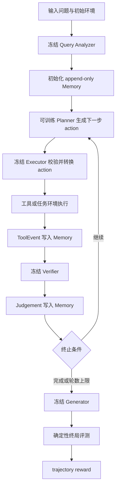

# 02 框架主线

## 1. 项目目标

项目研究一个明确问题：模块化 Agent 系统能否只依赖可验证的终局结果，定向优化系统内的 Planner，并提高整个系统完成多轮工具任务的能力。

四个角色形成稳定职责边界：

| 角色 | 参数状态 | 主要职责 |
|---|---|---|
| Query Analyzer | 冻结 | 提取目标、约束和初始线索 |
| Planner | 可训练 | 根据问题与 Memory 决定下一步子目标和工具动作 |
| Executor | 冻结 | 校验 Planner 的工具选择并固化严格工具参数 |
| Verifier | 冻结 | 根据已执行证据判断当前进度和 STOP/CONTINUE |
| Generator | 冻结 | 基于最终 Memory 形成任务答案 |

确定性工具环境执行动作，确定性终局评测器从最终答案或环境状态生成 reward。Verifier 提供循环控制判断，终局评测器提供训练信号，两项职责保持独立。

训练将系统成败归因到 Planner 的多轮 action。其他模块、工具和环境为 Planner 提供稳定的交互分布。

## 2. 统一 AgentFlow 状态机



每一轮都保存 Planner 的真实 prompt token、response token、response mask 和 rollout logprob。冻结角色文本进入后续 prompt 上下文，其 token 保持在 Planner 梯度范围之外。

## 3. 从轨迹到更新

```mermaid
flowchart LR
    D[RLHFDataset 中一个问题] --> N[同问题生成 K 条 session]
    N --> L[每条 session 运行多轮 AgentLoop]
    L --> O[每个 Planner turn 形成一行 AgentLoopOutput]
    O --> Q[TransferQueue]
    Q --> R[读取每条 session 的终局 reward]
    R --> A[同问题内标准化 trajectory advantage]
    A --> B[传播至该 session 的每个真实 Planner turn]
    B --> P[重算 old logprob]
    P --> G[veRL 原生 turn-level GSPO]
    G --> U[LoRA 参数更新]
    U --> S[checkpoint 与 rollout 权重同步]
```



层级关系：

1. **问题组**：同一个问题对应 `group_size` 条完整 session。
2. **完整轨迹**：一次 session 包含 1 到多轮 Planner action，终局奖励记录一次。
3. **Planner turn**：每轮 action 单独进入 GSPO 序列目标。
4. **Planner token**：同一 turn 的 token 共享该序列的标量 advantage，response mask 确定梯度范围。

设同一问题下第 `i` 条有效轨迹的终局奖励为 `R_i`，项目计算：

```text
A_i = (R_i - mean(R)) / population_std(R)
```

`A_i` 随后附加到该轨迹的全部真实 Planner turn。GSPO 对每个 turn 计算长度归一化的序列概率比与非对称裁剪目标。

## 4. 有效样本语义

项目区分两类失败：

- **模型行为失败**：动作格式错误、工具参数错误、答案错误、测试失败。轨迹保持有效，终局 reward 反映失败结果。
- **基础设施失败**：冻结服务异常、检索后端异常、Docker 进程异常等。轨迹标记为训练无效并退出 advantage 与 actor update。

组内有效 session 少于 2 条，或终局奖励方差低于阈值时，该组 advantage 设为 0，actor update 跳过该组 turn。这个规则保证更新来自具有相对偏好信息的组。

## 5. Memory 与上下文

`MemoryStore` 保存问题、分析、工具事件和 Verifier 判断，写入顺序保持完整轨迹可审计。四个任务都通过 `AgentFlowLoopBase.role_memory_text()` 依据 prompt 预算生成确定性 Memory view：

- 身份信息、当前任务状态和最新 Verifier 判断优先保留；
- 近期工具事件按时间倒序进入候选；
- 最终 view 恢复原时间顺序；
- prompt、系统指令和当前 action 预留固定 token 空间。

完整 Memory 用于日志与复盘，受预算约束的 view 用于模型推理。该设计控制长轨迹输入长度，同时保留任务状态连续性。

## 6. 实验主线

```text
数据准备与哈希审计
  -> 冻结模块服务健康检查
  -> baseline
  -> smoke / 32-prompt preflight
  -> Planner-only LoRA GSPO
  -> 周期 checkpoint 与 validation
  -> 独立测试集 evaluation
  -> 逐轨迹失败分析
```

GSM8K 与 Ticket 沿用 0.6B 模型、数据环境、终局评测和 GSPO 设置，并在 alpha 中接入完整角色链与共享 Memory。角色和提示词升级形成新的 rollout 分布，因此 baseline、训练和评测都从同一 alpha commit 重新执行。DeepResearch 与 Coding 分别从 Qwen3-4B Planner checkpoint 启动，并共享 GPU 0 上的 Qwen3-8B 冻结模块服务。四个任务分别保存 adapter，任务间参数保持隔离。

## 7. 项目边界

当前系统优化 Planner，终局结果提供主要学习信号，工具环境提供可复现反馈。研究扩展集中在过程奖励、角色联合优化、跨任务 Planner、异步 rollout 新鲜度校正以及持久化轨迹服务。

