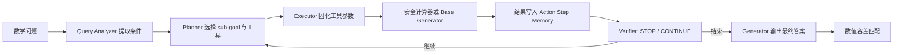
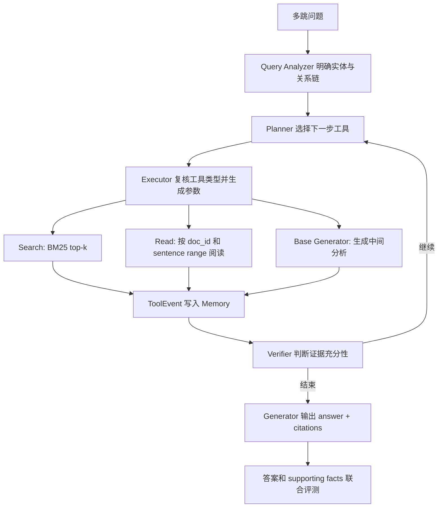
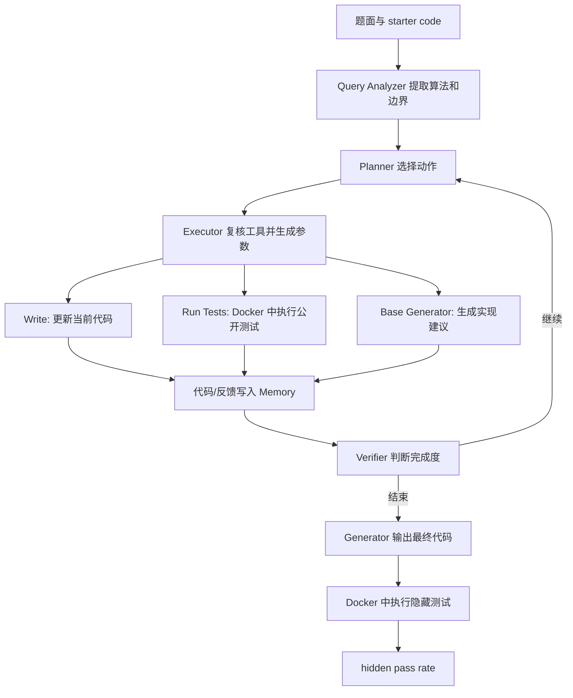

# 03 四任务流程

## 1. 任务对照

| 任务 | 核心能力 | Planner | 冻结模块 | 最大轮数 | 工具环境 | 终局奖励 |
|---|---|---|---|---:|---|---|
| GSM8K | 数学分解与计算器使用 | Qwen3-0.6B LoRA | Qwen3-0.6B | 3 | 安全算术解释器 | 数值匹配，0/1 |
| Ticket | 状态查询、定向更新与流程结束 | Qwen3-0.6B LoRA | Qwen3-0.6B | 数据定义 | 内存工单系统、Base Generator | 状态、finish、无副作用联合验证，0/1 |
| DeepResearch | 多跳检索、证据阅读与引用生成 | Qwen3-4B LoRA | Qwen3-8B | 5 | BM25/Lucene Search、Read、Base Generator | 答案与 supporting facts 的 joint F1 |
| Coding | 代码编写、公开测试、错误诊断与修复 | Qwen3-4B LoRA | Qwen3-8B | 5 | Docker Python 沙箱 | 隐藏测试通过率 |

GSM8K 与 Ticket 提供低成本、强可验证环境。DeepResearch 与 Coding 增加长上下文、真实工具后端、连续奖励和更长决策链。

## 2. GSM8K：数学推理与计算器

### 输入与数据

训练集采用 1,327 条 calculator-structured 样本，测试集采用 319 条独立样本。问题以数学事实与问题目标组织，gold answer 用于终局数值匹配。

### 运行流程



正式配置使用冻结 Executor 校验 Planner 的工具选择并固化参数；单卡 smoke 使用确定性 dispatch。Planner 可选择 Calculator 或 Base Generator，计算器只解析允许的算术表达式，执行结果和 Verifier 判断共同进入下一轮 Memory。旧版 `Sub_goal + Calculation` 输出仍可由兼容解析器转换为 Calculator action。

### 验证与训练信号

Generator 文本提取最后一个数值，预测值与 gold answer 的绝对误差在 `1e-6` 内时 reward 为 1。格式错误、计算错误和终局答案错误形成有效的零奖励轨迹。

## 3. Ticket：可验证状态更新

### 输入与数据

每条 episode 包含用户请求、初始工单状态、目标字段、目标值、目标 ticket ID、finish outcome、课程模式和最大步数。正式数据由确定性合成器生成，direct 与 indirect 各占一半。

### 两类流程

```text
direct:
Query Analyzer -> Planner -> Executor(Update) -> Verifier
               -> Planner -> Executor(Finish) -> Verifier STOP -> Generator

indirect:
Query Analyzer -> Planner -> Executor(Query) -> Verifier -> 获得 ticket_id
               -> Planner -> Executor(Update) -> Verifier
               -> Planner -> Executor(Finish) -> Verifier STOP -> Generator
```

每一轮 Planner 输出严格 JSON 工具调用：

- `Ticket_Query_Tool`：按可见条件查询目标工单；
- `Ticket_Update_Tool`：更新指定 ticket 的单个目标字段；
- `Ticket_Finish_Tool`：提交 ticket ID 与业务 outcome。
- `Base_Generator_Tool`：为未解决的局部目标生成辅助分析。

环境在 session 内维护独立状态，工具返回值和 Verifier 判断形成 `ToolEvent` 与 judgement，并进入共享 Memory。`Ticket_Finish_Tool` 负责写入业务提交状态，Verifier 负责循环停止决策。

### 终局验证

reward 为 1 需要同时满足：目标 ticket 的指定字段达到目标值、业务动作顺序与 direct/indirect 合同一致、indirect 查询字段和值准确定位目标 ticket、finish 提交正确、动作与工具成功、步数满足约束、其他 ticket 和其他字段保持稳定。失败码覆盖 `INVALID_ACTION`、`TOOL_ERROR`、`WRONG_ACTION_ORDER`、`WRONG_LOOKUP`、`GOAL_NOT_MET`、`COLLATERAL_MUTATION`、`MISSING_FINISH` 和 `WRONG_FINISH`。

## 4. DeepResearch：多跳检索与引用

### 输入与课程数据

任务使用 HotpotQA distractor、2WikiMultiHopQA 和 HotpotQA FullWiki 三类环境。训练按以下难度方向推进：

1. attached context 中的受限检索；
2. 2Wiki 完整 supplied-context 索引；
3. HotpotQA 百万文档 FullWiki 索引。

validation 与 final evaluation 从带标签开发集按稳定哈希形成互斥集合。

### 运行流程



Search 返回 `doc_id`、标题、BM25 分数和摘要；Read 返回全局 sentence ID、正文分页和下一页位置。Memory 保留完整搜索与阅读记录，各角色 prompt 使用 8,192 token 输入上限内的确定性投影。

### 检索与奖励

本地 context 使用内存 BM25，正式全库检索使用 Pyserini/Lucene。HotpotQA 与 2Wiki 使用独立索引，sentence ID 语义跟随各自 benchmark。

终局输出包含答案和 `(title, sentence_id)` 引用。评测分别计算 answer EM/F1、supporting-fact EM/F1，并将两者 precision、recall 相乘后计算 joint F1，joint F1 直接作为 `[0,1]` reward。

## 5. Coding：代码生成与隔离执行

### 输入与数据

任务采用 TACO-Verified Easy/Medium，支持标准输入题和函数调用题。数据准备执行题面指纹去重、任务类型过滤、稳定 80/10/10 划分，并把每题测试拆分为公开测试和隐藏测试。

### 运行流程



公开测试反馈支持多轮修复，隐藏测试只在终局评测阶段执行。reward 等于隐藏测试通过数除以隐藏测试总数；全部通过对应 success。

## 6. 四任务共享接口

四个 AgentLoop 最终都返回 `list[AgentLoopOutput]`，每个元素对应一个真实 Planner turn。共享字段包括：

- 精确 prompt/response token IDs；
- rollout logprob 与 response mask；
- `uid`、session、turn index；
- 工具调用计数与终止原因；
- 终局 reward、验证指标和有效性标志。

四个任务共享 Query Analyzer、Planner、Executor、Memory、Verifier、Generator、终局规则评测和 Planner-turn 输出契约。任务扩展实现数据 schema、Prompt、environment/tool、terminal verifier 和 AgentLoop，并在 `configs/agent_loops.yaml` 注册；veRL Trainer 与 GSPO 适配层保持复用。

