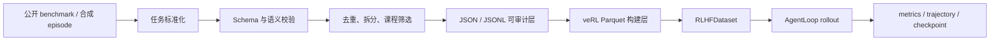

# 05 数据、存储、沙箱与通信

## 1. 数据流水线

四任务数据处理：

| 任务 | 来源 | 标准化与筛选 | 训练输入 |
|---|---|---|---|
| GSM8K | 重写后的数学任务 | calculator-structured learnable 集合、独立测试集 | `data/verl/gsm8k/*.parquet` |
| Ticket | schema 2.0.0 确定性合成 | direct/indirect 平衡、split 独立哈希 | `data/verl/ticket/*.parquet` |
| DeepResearch | HotpotQA、2WikiMultiHopQA | question/supporting facts 统一、去重、稳定 validation/test、课程限额 | `data/verl/deepresearch/*.parquet` |
| Coding | TACO-Verified | Easy/Medium、题面指纹去重、类型过滤、80/10/10、public/hidden tests | `data/verl/coding/*.parquet` |

Parquet 行使用 veRL 约定字段：`data_source`、`prompt`、`ability`、`reward_model`、`extra_info` 和 `agent_name`。任务完整环境状态保存在 `extra_info`，运行时由 AgentLoop 还原。

## 2. 数据库与存储管理方案

### 当前单机方案

| 数据层 | 介质 | 管理原则 |
|---|---|---|
| 原始与标准数据 | JSON/JSONL | 人工可读、append-friendly、逐条审计 |
| 训练输入 | Apache Parquet | 列式压缩、PyArrow/pandas 高效读取、适配 RLHFDataset |
| 检索语料 | Apache Lucene index | BM25 倒排索引、doc ID 定位、sentence ID 保真 |
| 任务状态 | Python 进程内对象 | 每条 session 隔离，Ticket 状态和 Memory 随轨迹保存 |
| 实验指标 | JSONL | 训练中持续追加，支持崩溃后保留已有记录 |
| 轨迹 | JSONL | 保存 action、tool result、judgement、reward 和错误码 |
| 模型状态 | veRL checkpoint、PEFT adapter | 按任务和阶段分目录，支持 resume 与课程衔接 |
| 完整性元数据 | manifest + SHA-256 | 记录来源、行数、split、限制和文件哈希 |

该方案面向一台双 GPU 主机，数据路径、模型路径和输出路径统一放在扩展数据盘。源数据和训练产物采用分层目录，manifest 将内容身份与文件位置解耦。

### 扩展型实验数据库

实验数量增长后，可增加 SQLite 作为单机元数据目录，表结构聚焦 `datasets`、`runs`、`checkpoints`、`artifacts` 和 `evaluations`。主键使用 run ID 或内容哈希，文件正文继续保存在 Parquet、JSONL、Lucene 和 checkpoint 目录。

多机调度阶段可将元数据目录迁移到 PostgreSQL，将大文件迁移到 S3 兼容对象存储。数据库负责事务状态、血缘和索引，对象存储负责模型、轨迹和数据集正文。

## 3. DeepResearch 检索管理

DeepResearch 提供两个 `ResearchIndex` 实现：

- `InMemoryBM25Index`：适合 attached-context、测试和小规模预跑；
- `PyseriniResearchIndex`：包装 `LuceneSearcher`，服务正式 2Wiki 与 HotpotQA FullWiki。

HotpotQA 和 2Wiki 使用独立索引。构建过程保留 title、sentence 顺序与 document ID。远程门禁抽样检查 gold title 检索、sentence ID 边界和 source sentence 文本，随后开放 GPU 实验。

索引容量与 JVM 并发通过三项约束管理：

1. `JAVA_TOOL_OPTIONS=-Xms1g -Xmx8g` 控制 Lucene JVM heap；
2. DeepResearch AgentLoop worker 数设为 2；
3. `asyncio.Semaphore` 限制同时运行的检索调用。

## 4. Coding 沙箱

正式 Coding 轨迹使用 `DockerSandbox`。宿主进程通过 stdin 发送 JSON 请求，容器 stdout 返回 JSON 结果。容器每次调用即创建、执行和回收。

安全与资源约束：

| 维度 | 配置 |
|---|---|
| 网络 | `--network none` |
| 根文件系统 | `--read-only` |
| Linux capabilities | `--cap-drop ALL` |
| 权限提升 | `no-new-privileges` |
| CPU | 2 cores |
| 内存 | 4 GiB，swap 总上限 4 GiB |
| 进程数 | 128 |
| 文件描述符 | 64 |
| 临时目录 | 256 MiB tmpfs，`noexec,nosuid` |
| 测试预算 | 默认每个 suite 10 秒 |
| 容器生命周期 | `--rm` 自动回收 |

runner 支持 standard-input 与 call-based 测试，包含 `Solution` 类方法、JSON 参数、数值容差和总 suite deadline。公开测试结果进入 Memory，隐藏测试只返回终局通过率和失败类别。

## 5. 前后端与进程间通信

| 调用方 | 接收方 | 协议 | 载荷 |
|---|---|---|---|
| AgentLoop | GPU 0 冻结 vLLM | OpenAI-compatible HTTP/JSON | chat messages、采样参数、文本响应 |
| AgentLoop | GPU 1 Planner vLLM | veRL async server manager | prompt token IDs、sampling params、token IDs、logprob |
| AgentLoop worker | Trainer | TransferQueue/TensorDict | response mask、reward、metadata、变长 token 序列 |
| Python host | Docker container | stdin/stdout JSON | code、tests、timeout、pass/failure |
| Python host | Lucene JVM | Pyserini Python API | query、top-k、doc ID、stored JSON |
| shell runner | Python launcher | CLI/YAML/environment | config、override、adapter path、输出路径 |

HTTP 层负责冻结模型服务化，veRL 内部通道负责可训练 token 的精确传递，TransferQueue 负责 rollout 与 learner 解耦，stdin/stdout 负责一次性沙箱请求隔离。

## 6. 数据一致性和恢复

- split 使用固定 seed 与稳定内容哈希，输入顺序变化保持集合身份稳定；
- manifest 同时记录 available rows、selected rows、限制和 SHA-256；
- Ticket 每个 rollout 创建全新环境，轨迹状态互相隔离；
- checkpoint 按固定频率保存，`resume_mode=auto` 支持训练恢复；
- DeepResearch 课程阶段导出标准 adapter，后一阶段从前一阶段 Planner 权重继续；
- metrics 和 rollout JSONL 提供训练过程、工具行为和失败码的联合审计。

