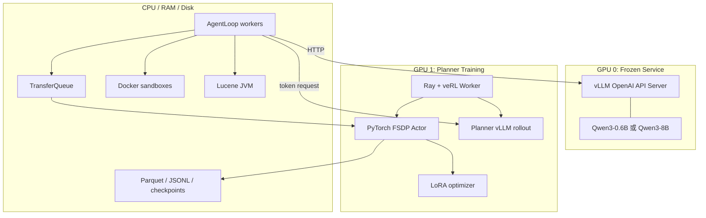

# 06 软硬件执行流

## 1. 目标硬件

| 资源 | 正式环境 |
|---|---|
| GPU | 2 x NVIDIA A800 80 GB，Ampere `sm_80` |
| CPU | 22 logical cores，Xeon Platinum 8470Q |
| 内存 | 110 GB |
| 数据盘 | 扩展到约 340 GB，启动门禁要求至少 200 GiB 可用 |
| 系统盘 | 30 GB，主要承载系统与基础工具 |
| 操作系统 | Linux |
| Python | 3.11 |
| CUDA/Driver | 由远程审计确认，驱动支持目标 PyTorch/vLLM wheel |

项目根目录放在扩展数据盘，使 `model/`、`data/`、`outputs/` 和 Lucene index 共享同一高容量文件系统。

## 2. GPU 拓扑



GSM8K/Ticket 阶段使用 Qwen3-0.6B 冻结服务与 Qwen3-0.6B Planner。DeepResearch/Coding 阶段使用 Qwen3-8B 冻结服务与 Qwen3-4B Planner。两阶段通过重启 GPU 0 服务切换模型。

## 3. 正式训练参数

| 参数 | GSM8K | Ticket | DeepResearch | Coding |
|---|---:|---:|---:|---:|
| prompt batch | 4 | 4 | 4 | 4 |
| group size | 6 | 8 | 6 | 6 |
| actor epochs | 2 | 2 | 1 | 1 |
| turn mini-batch 上限 | 4 | 4 | 8 | 8 |
| micro-batch/GPU | 1 | 1 | 1 | 1 |
| learning rate | `2e-6` | `2e-6` | `1e-6` | `1e-6` |
| rollout temperature | 1.2 | 1.2 | 1.0 | 1.0 |
| prompt 上限 | 2,048 | 2,048 | 4,096 | 4,096 |
| Planner response 上限 | 512 | 512 | 1,024 | 1,024 |
| 最大 Planner 轮数 | 3 | episode 定义 | 5 | 5 |

四任务都使用 LoRA rank 64、alpha 128、all-linear，KL reward coefficient 和 KL loss 均设为 0。DeepResearch/Coding 使用更窄的 GSPO clip `3e-4/4e-4`，GSM8K/Ticket 保留 `1e-3/3e-3`。

## 4. 单步软件流

```text
1. RLHFDataset 从 Parquet 读取 prompt batch
2. veRL 为每个 prompt 创建 group sessions
3. Ray 调度 task-specific AgentLoop
4. AgentLoop 调用 GPU 0 完成冻结角色推理
5. AgentLoop 调用 GPU 1 Planner vLLM 生成 action token
6. CPU 执行 calculator / ticket state / Lucene / Docker
7. ToolEvent 与 judgement 写入 Memory
8. 循环至 finish、Verifier STOP、step limit 或 deadline
9. Generator 形成终局输出，确定性 verifier 计算 reward
10. 每个 Planner turn 写入 TransferQueue
11. Trainer 按 query group 计算 advantage
12. FSDP actor 重算 old logprob 并执行 GSPO backward
13. optimizer 更新 LoRA，权重同步到 Planner rollout engine
14. metrics、rollout 与 checkpoint 写入数据盘
```

## 5. 进程启动顺序

### 环境与数据阶段

1. 校验 ZIP 和逐文件 SHA-256。
2. 创建 Python 3.11 环境并安装固定 veRL/vLLM 栈。
3. 执行 `audit_environment.sh`。
4. 下载 Qwen3-0.6B、Qwen3-4B、Qwen3-8B 到 `model/Qwen/`。
5. 准备 DeepResearch、Coding 数据与 veRL Parquet。
6. 构建 Lucene indexes 和 Coding Docker image。
7. 执行研究检索与代码沙箱门禁。

### 0.6B 任务阶段

1. GPU 0 启动 Qwen3-0.6B frozen server。
2. 依次运行 GSM8K baseline、smoke、train、eval。
3. 依次运行 Ticket baseline、smoke、train、eval。

### 8B 冻结模块阶段

1. GPU 0 启动 Qwen3-8B frozen server。
2. DeepResearch 执行 baseline、32-prompt preflight、三阶段训练、eval。
3. Coding 执行 baseline、32-prompt preflight、train、eval。

DeepResearch 与 Coding 各自保存独立 Planner adapter。DeepResearch 三个课程阶段顺序传递 adapter，并为每阶段创建新的 optimizer 状态。

## 6. 资源流

### 显存

- GPU 0 主要保存冻结模型权重、KV cache 和 vLLM 批处理工作区；
- GPU 1 同时保存 Planner actor、LoRA/optimizer、Planner rollout KV cache 和 FSDP 工作区；
- `gpu_memory_utilization=0.45` 为 actor 与 rollout 共置预留空间；
- micro-batch 1 和 remove padding 控制变长 turn 的训练峰值。

### CPU 与内存

- Ray driver、AgentLoop、Parquet reader 和日志写入使用 CPU；
- Lucene JVM heap 上限 8 GB；
- Docker 单容器上限 4 GB，默认并发 1；
- Pyserini worker 数和 semaphore 控制多 JVM/检索并发。

### 磁盘

- 模型权重、FullWiki corpus 和 Lucene index 构成主要静态占用；
- rollout JSONL、validation dump 和 checkpoint 构成随训练增长的动态占用；
- GSM8K/Ticket 每 25 步保存与验证，DeepResearch/Coding 每 64 步保存与验证；
- adapter 导出保留跨课程阶段需要的 Planner 权重。

## 7. 远程正式运行门禁

preflight 输出需要同时具备：有效工具事件、组内 reward 方差、正数 trainable-turn count、有限 loss、有限 gradient norm、checkpoint 和包含工具反馈的后续 Planner prompt。DeepResearch 额外验证索引覆盖，Coding 额外验证容器隔离和输出上限。

正式训练期间持续观察 GPU 显存、rollout latency、工具延迟、有效轨迹率、零方差组比例、old-logprob 行数、gradient norm、response length、checkpoint 时间和磁盘余量。

