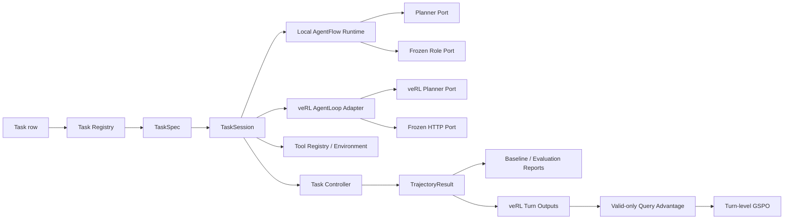

# AgentFlow RL v3 Extensible Task SDK Design

**Date:** 2026-07-16  
**Status:** Historical design exploration; superseded by `docs/architecture.md`
**Review source:** `C:\Users\north\Desktop\agentflow\main\project`  
**Current rewrite:** `C:\Users\north\Desktop\agentflow\project_v3`  
**Pinned training framework:** veRL v0.8.0, commit `7aed6b230776f963fa09509c10d9c3a767d1102c`

The implemented alpha uses veRL's configured AgentLoop registry as the task
plugin boundary. `AgentFlowLoopBase`, `MemoryStore`, Planner/frozen-model ports,
trajectory metadata, terminal verification records, and the Trainer/GSPO adapter
form the reusable runtime. Each task keeps an explicit Python state machine for
its action schema, tools, environment, and terminal evaluator. Class sketches
for `TaskSpec`, `TaskController`, and a separate local runtime below remain
conceptual sketches from the earlier design direction.

## 1. Goal

Complete v3 as an independent, runnable, language-only AgentFlow reinforcement-learning repository that preserves the reviewed experiments and the architectural spirit of v1:

- roles, tasks, tools, environments, and rewards are replaceable;
- a new task can be added without changing the veRL Trainer;
- task execution is usable without veRL for baseline, evaluation, debugging, and tests;
- veRL remains the distributed rollout and training backend rather than becoming the task runtime itself;
- Ticket and GSM8K remain the reference task plugins;
- formal training remains Planner-only LoRA, turn-level GSPO, with no SFT stage.

The design does not copy the old monolithic `Solver`. It extracts its useful boundaries into explicit protocols and keeps task logic independent from any one orchestration or training framework.

## 2. Scope

### 2.1 In scope

1. Introduce a framework-neutral Task SDK.
2. Introduce a reusable local AgentFlow runtime.
3. Adapt the same Task SDK to veRL `AgentLoopBase`.
4. Preserve the reviewed Ticket and GSM8K task semantics.
5. Repair the known v3 training, evaluation, lifecycle, and observability defects.
6. Add deterministic rollout identity and seed derivation.
7. Add local baseline/evaluation commands that do not require Ray or veRL.
8. Add remote Linux CUDA smoke, training, checkpoint evaluation, and adapter export paths.
9. Add contract, unit, integration, parity, and optional GPU tests.
10. Attempt installation of the non-GPU veRL dependency chain in `all-in-rag`, while treating Linux CUDA as the supported formal environment.

### 2.2 Out of scope

- SFT, DPO, a critic, value learning, or reference-policy KL;
- multimodal inputs;
- a production ticketing backend;
- reintroducing LangGraph or TRL;
- a general visual workflow editor or workflow DSL;
- dynamically downloading arbitrary third-party task plugins at runtime;
- guaranteeing deterministic token sampling across different vLLM versions or GPU kernels;
- making vLLM or the full veRL CUDA stack supported on Windows.

## 3. Preserved Experiment Contract

### 3.1 Training hierarchy

For one query:

```text
query
  -> N complete trajectory sessions
  -> one binary reward per valid trajectory
  -> query-local population mean/std
  -> one scalar advantage per trajectory
  -> broadcast to that trajectory's real Planner turns
  -> one veRL sequence row per Planner turn
  -> native asymmetric turn-level GSPO
```

Only the final output of each valid session enters reward mean/std. Earlier turns never enter normalization again. Infrastructure-invalid sessions are excluded. Model-valid failures remain binary-zero trajectories. Groups with fewer than two valid sessions or population standard deviation below `1e-6` produce no trainable rows.

### 3.2 Objective and sampling

- Planner sampling temperature: `1.2`
- Planner top-p: `1.0`
- Planner top-k: disabled (`-1`)
- repetition penalty: `1.0`
- GSPO low clip: `0.001`
- GSPO high clip: `0.003`
- actor epochs over one frozen rollout batch: `2`
- LoRA rank: `64`
- LoRA alpha: `128`
- target modules: `all-linear`
- reward: binary
- no KL reward
- no KL actor loss

Saved Planner prompt IDs and response IDs are the only trainable token path. Frozen role generations, tool responses, verifier text, and final Generator text never enter the Planner response mask.

### 3.3 Experiment sequence

Each task supports:

```text
prepare data
  -> frozen AgentFlow baseline
  -> Planner-only LoRA GSPO training
  -> trained checkpoint or exported-adapter evaluation
```

## 4. Architecture



The central rule is that task semantics live in the Task SDK. The local runtime and veRL adapter are two execution frontends over the same task controller.

## 5. Task SDK

### 5.1 Core data models

The framework defines immutable or strictly validated records:

```python
@dataclass(frozen=True)
class RolloutIdentity:
    query_id: str
    session_id: int
    policy_version: int
    base_seed: int

    def turn_seed(self, turn_index: int) -> int: ...


@dataclass(frozen=True)
class GeneratedTurn:
    prompt: str
    response: str
    prompt_ids: tuple[int, ...]
    response_ids: tuple[int, ...]
    response_logprobs: tuple[float, ...]
    sampling_temperature: float


@dataclass(frozen=True)
class TrajectoryResult:
    identity: RolloutIdentity
    reward: float
    valid_for_training: bool
    failure_kind: FailureKind | None
    terminal_reason: str
    turns: tuple[PlannerTurnRecord, ...]
    events: tuple[ToolEvent, ...]
    verification: dict[str, Any]
    artifacts: dict[str, Any]
    metrics: dict[str, float]
```

`TrajectoryResult` is produced even when the failure happens before the first Planner turn. It is the canonical result for local execution and the source used to construct veRL outputs.

### 5.2 TaskSpec protocol

```python
class TaskSpec(Protocol):
    name: str

    def parse_row(self, row: Mapping[str, Any]) -> TaskInput: ...

    def create_controller(
        self,
        task_input: TaskInput,
        *,
        identity: RolloutIdentity,
        frozen_model: FrozenRolePort,
        planner: PlannerPort,
        deadline: Deadline,
        config: Mapping[str, Any],
    ) -> TaskController: ...
```

The registry operates on `TaskSpec`, not directly on veRL classes.

### 5.3 TaskController protocol

```python
class TaskController(Protocol):
    async def run(self) -> TrajectoryResult: ...
```

Task-specific control flow remains explicit Python. Ticket and GSM8K may use different internal state machines, but both return the same trajectory protocol.

The controller owns:

- task state and memory;
- task-specific role prompts;
- tool/environment execution;
- step limits and terminal decisions;
- model-valid versus infrastructure-invalid classification;
- binary verification and artifacts.

It does not own:

- distributed scheduling;
- model weight synchronization;
- actor loss;
- checkpointing;
- veRL TransferQueue operations.

### 5.4 Task registry

```python
class TaskRegistry:
    def register(self, spec: TaskSpec) -> None: ...
    def get(self, name: str) -> TaskSpec: ...
    def names(self) -> tuple[str, ...]: ...
```

Built-in registration includes:

```text
ticket -> TicketTaskSpec
gsm8k -> GSM8KTaskSpec
```

A third task is added by implementing its `TaskSpec`, `TaskController`, prompts, environment/tools, verifier, data converter, and configs. No Trainer modification is permitted.

## 6. Model Ports

### 6.1 PlannerPort

```python
class PlannerPort(Protocol):
    async def generate(
        self,
        *,
        identity: RolloutIdentity,
        turn_index: int,
        system_prompt: str,
        user_prompt: str,
        sampling: SamplingSpec,
        deadline: Deadline,
    ) -> GeneratedTurn: ...
```

Implementations:

- `VeRLPlannerPort`: calls `LLMServerClient.generate()` with exact prompt IDs;
- `OpenAIPlannerPort`: local/baseline OpenAI-compatible backend;
- `ScriptedPlannerPort`: deterministic tests.

The veRL implementation uses `AgentLoopBase.apply_chat_template()` through an injected prompt encoder so that prompt-length enforcement matches veRL. It must not call the tokenizer template directly without the framework length contract.

### 6.2 FrozenRolePort

```python
class FrozenRolePort(Protocol):
    async def generate(self, request: FrozenRoleRequest) -> str: ...
    async def close(self) -> None: ...
```

Implementations:

- shared OpenAI-compatible async client;
- optional local Transformers implementation for local smoke/debugging;
- scripted implementation for tests.

The HTTP implementation:

- reuses one client per worker/runtime;
- uses bounded retry for connection, timeout, rate-limit, and 5xx failures;
- uses the trajectory deadline as the outer timeout;
- exposes retry count and latency metrics;
- closes the client during runtime shutdown.

## 7. Runtime

### 7.1 AgentFlowRuntime

```python
class AgentFlowRuntime:
    async def run_one(
        self,
        *,
        task_name: str,
        row: Mapping[str, Any],
        identity: RolloutIdentity,
        config: Mapping[str, Any],
    ) -> TrajectoryResult: ...

    async def run_group(
        self,
        *,
        task_name: str,
        row: Mapping[str, Any],
        group_size: int,
        policy_version: int,
    ) -> tuple[TrajectoryResult, ...]: ...

    async def close(self) -> None: ...
```

It creates a fresh task controller and fresh mutable task environment for every session while sharing stateless model clients where safe.

### 7.2 Local baseline and evaluation

Framework-neutral commands:

```text
python -m agentflow_rl.cli.baseline --config ...
python -m agentflow_rl.cli.evaluate --config ... --adapter-path ...
```

They:

- load task rows through the task registry;
- run complete trajectories;
- write one structured trajectory JSONL row per session;
- write summary JSON and metrics JSONL;
- support `--limit`, concurrency, deterministic identity, and overwrite control;
- do not import Ray, TransferQueue, or veRL.

### 7.3 veRL adapter

One generic registered AgentLoop class reads `agentflow.task` from config, resolves the TaskSpec, runs the controller, and converts `TrajectoryResult` to `list[AgentLoopOutput]`.

For a normal valid trajectory:

```text
one AgentLoopOutput per real Planner turn
reward only on final Planner output
```

For an infrastructure-invalid trajectory with no Planner turn:

```text
one synthetic non-trainable diagnostic output
response_mask all zeros
reward zero
valid_for_training false
```

The diagnostic row exists only for accounting and logging. It must be removed before actor old-log-prob computation and actor update.

## 8. Advantage and Training Adapter

### 8.1 Trainable-row selection

The Trainer adapter derives:

```python
@dataclass(frozen=True)
class AdvantageSelection:
    advantages_by_key: dict[str, float]
    trainable_keys: tuple[str, ...]
    invalid_keys: tuple[str, ...]
    skipped_keys: tuple[str, ...]
    metrics: AdvantageMetrics
```

Rules:

1. Find each session's highest real turn index.
2. Exclude infrastructure-invalid sessions from normalization.
3. If fewer than two valid sessions exist in a query group, mark every row in the group skipped.
4. If population std is below `1e-6`, mark every row in the group skipped.
5. Otherwise calculate one advantage per final trajectory and broadcast it to that session's real turns.
6. Remove infrastructure-invalid and diagnostic rows before old-log-prob computation. Retain valid skipped rows so likelihood diagnostics cover real rollout actions.
7. Remove invalid, skipped, diagnostic, and padding rows before actor update.
8. Choose the largest configured memory-bounded mini-batch that evenly divides the remaining trainable turns. Set actor `global_batch_size` and `mini_batch_size` to that per-update mini-batch size, matching veRL's optimizer-step boundary.
9. If no trainable rows remain, skip actor update and record the reason.

This restores the v2 semantic contract: invalid and skipped rows do not reduce valid gradient magnitude by entering the GSPO denominator.

### 8.2 veRL GSPO

The custom Trainer continues to use veRL native:

```text
policy_loss.loss_mode = gspo
```

One row is one Planner turn. The same scalar trajectory advantage is expanded across the response mask of that row. veRL computes the response-length-normalized sequence importance ratio and asymmetric clipping.

### 8.3 Likelihood consistency

- rollout saves exact token IDs and rollout log probabilities;
- actor recomputes proximal `old_log_probs` on those exact IDs;
- actor temperature metadata is `1.2`;
- top-p is `1.0`, so nucleus renormalization reconstruction is unnecessary;
- no decoded/re-tokenized response enters actor likelihood scoring.

## 9. Determinism and Provenance

### 9.1 Identity

Stable query identity comes from task data, not a random UUID used as the sole provenance key. veRL's internal key may remain unique, but `extra_fields` must retain:

```text
task_name
query_id
session_id
turn_index
policy_version
rollout_seed
source_index
```

### 9.2 Seed derivation

```text
seed = blake2b(
  base_seed | policy_version | stable_query_id | session_id
)
```

Per-turn seeds derive from the trajectory seed and turn index. The seed is sent to Planner backends when supported and always logged.

The contract guarantees stable identity and seed calculation. It does not claim bitwise identical vLLM results across different versions, devices, or concurrency schedules.

### 9.3 Run manifest

Every run writes:

- resolved config and fingerprint;
- project git commit;
- veRL commit;
- model/tokenizer path and revision if known;
- dataset source hashes;
- environment versions;
- CUDA and GPU information;
- policy version/checkpoint;
- task registry entries;
- sampling and objective parameters.

## 10. Checkpoint and Adapter Lifecycle

### 10.1 Resume

Training resume uses veRL distributed checkpoints and requires compatible:

- model path;
- LoRA rank/alpha/targets;
- task name;
- dataset fingerprint;
- objective and sampling contract.

A compatibility validator runs before `resume_path`.

### 10.2 Checkpoint evaluation

Checkpoint evaluation has a dedicated config mode with `lora_rank=64`. The CLI applies checkpoint metadata before model construction. It must not try to load a rank-64 checkpoint into a rank-zero model.

### 10.3 PEFT adapter export

A command exports an HF-compatible PEFT adapter from a veRL checkpoint:

```text
python -m agentflow_rl.cli.export_adapter \
  --checkpoint outputs/ticket/train/global_step_20 \
  --output outputs/ticket/train/adapters/global_step_20
```

Evaluation accepts either:

- a complete veRL checkpoint;
- an exported PEFT adapter.

The baseline path always uses rank zero and refuses an adapter/checkpoint argument.

## 11. Observability

### 11.1 Structured trajectory log

Every local and veRL session writes or exposes:

```text
task/query/session/policy/seed identity
validity and failure kind
terminal reason
binary reward
Planner prompts, responses, exact token lengths
parsed actions
tool events and results
GSM8K verifier judge memory
final answer and verification
per-role latency and retry counts
```

Sensitive arbitrary environment objects are not serialized; task plugins provide JSON-safe snapshots.

### 11.2 Training metrics

Required custom metrics:

- query group count;
- expected and observed trajectory count;
- valid and invalid trajectory count;
- trainable, skipped, diagnostic, padding, and total turn count;
- zero-variance and fewer-than-two-valid group counts;
- reward and advantage population moments;
- direct/indirect Ticket success;
- GSM8K verifier-stop and final numeric-match success;
- actor update skipped flag/reason;
- rollout and frozen-role latency;
- frozen-role retry count;
- prompt and response length;
- rollout/actor log-prob consistency metrics available from veRL.

veRL-native turn-flattened reward metrics are retained but documented as distinct from `agentflow/*` trajectory metrics.

### 11.3 Generation dumps

The project adds a task-aware trajectory writer instead of relying only on veRL's prompt/response generation dump. veRL's native dump remains available for token-level inspection.

## 12. Error Semantics

### 12.1 Model-valid failures

Remain trainable binary-zero trajectories:

- malformed Planner JSON;
- invalid tool arguments;
- tool-domain errors;
- wrong final answer;
- step limit;
- trajectory deadline/time limit;
- Verifier chooses CONTINUE until the limit.

### 12.2 Infrastructure-invalid failures

Excluded from advantage and actor update:

- frozen server unavailable after retry budget;
- Planner server/Ray/TransferQueue failure;
- corrupted tokenizer/model response protocol;
- unexpected internal exception;
- invalid source row discovered after dataset validation should have run.

Every failure produces a `TrajectoryResult`, including pre-Planner failure.

## 13. Ticket Reference Plugin

Ticket preserves:

```text
Frozen Query Analyzer
  -> direct: Update -> Finish
  -> indirect: Query by customer/order -> Update returned ticket -> Finish
  -> deterministic binary verification
```

Requirements:

- fresh isolated environment per session;
- exactly 50:50 direct/indirect formal data;
- strict action union schema;
- copied identifiers and no hidden target leakage;
- binary reward only when the requested mutation and Finish submission are both correct;
- collateral mutations fail verification.

## 14. GSM8K Reference Plugin

GSM8K preserves:

```text
Frozen Query Analyzer
  -> Planner
  -> legacy_llm Executor or deterministic dispatch
  -> Calculator
  -> Frozen Verifier
  -> judge feedback enters next Planner memory
  -> Frozen direct Generator
  -> numeric-match binary reward
```

Formal baseline/train/eval use `legacy_llm`; smoke may use deterministic execution.

The reviewed shared system prompt and Query Analyzer, Planner, Executor, Verifier, and Generator prompts remain unchanged unless a separate prompt-change specification is approved.

## 15. Configuration

Configuration is split into:

```text
configs/runtime/       local/shared model and concurrency settings
configs/tasks/         task plugin and task-specific limits
configs/verl/          veRL actor/rollout/trainer settings
configs/experiments/   baseline/smoke/train/eval compositions
```

Hydra composition is used only for configuration. Task code accepts ordinary mappings or validated dataclasses and does not depend on Hydra objects.

A validation layer rejects:

- top-p other than `1.0` for training;
- nonpositive temperature for sampled training;
- group size below two;
- wrong clip values for formal configs;
- rank-zero checkpoint evaluation;
- training with no LoRA;
- baseline with LoRA;
- unknown task names;
- incompatible resume fingerprints.

## 16. Dependency and Environment Strategy

### 16.1 Local Windows / `all-in-rag`

Attempt to install:

- `hydra-core`;
- `ray` if a Python 3.12 Windows wheel is available;
- `tensordict`;
- `torchdata`;
- `TransferQueue==0.1.6` if supported;
- editable project package;
- pinned veRL source without forcing the unsupported vLLM runtime.

Local required gates:

- pure Task SDK tests;
- local runtime scripted-model tests;
- config composition where dependencies permit;
- data conversion;
- exact token protocol fake-server tests;
- Trainer semantic tests against isolated veRL-compatible structures where full import is unavailable.

Failure to install a Windows-incompatible package is documented, not hidden or replaced with an unpinned alternative.

### 16.2 Remote Linux CUDA

Supported formal environment:

- Python 3.10 or 3.11;
- CUDA-compatible PyTorch selected for the remote driver;
- pinned veRL commit;
- vLLM version compatible with that veRL commit;
- Ray and TransferQueue versions from the lock/pins;
- GPU0 frozen OpenAI-compatible vLLM server;
- GPU1 Ray-visible veRL actor and Planner rollout.

Remote gates:

1. full Hydra config validation;
2. one-query baseline for both tasks;
3. group-size-four variance rollout;
4. two-step LoRA smoke;
5. checkpoint resume for one additional step;
6. checkpoint evaluation;
7. adapter export and adapter evaluation;
8. formal training only after all prior gates pass.

## 17. Repository Structure

Target structure:

```text
src/agentflow_rl/
  core/
    identity.py
    records.py
    errors.py
    deadline.py
    config.py
  ports/
    planner.py
    frozen.py
  runtime/
    registry.py
    engine.py
    logging.py
  tasks/
    base.py
    ticket/
    gsm8k/
  verl/
    agent_loop.py
    planner.py
    advantage.py
    trainer.py
    entrypoint.py
    checkpoint.py
  cli/
    baseline.py
    evaluate.py
    export_adapter.py
    prepare_data.py
  synthesis/
```

Compatibility re-exports may be retained temporarily, but production code has one canonical definition for identity, records, ports, and failure semantics.

## 18. Testing Strategy

### 18.1 Contract tests

- version and dependency pins;
- no TRL/LangGraph runtime dependency;
- formal objective/sampling values;
- task plugin registration;
- third-task fixture does not modify Trainer;
- checkpoint/eval LoRA compatibility.

### 18.2 Unit tests

- identity and deterministic seed derivation;
- Task Registry duplicate/unknown behavior;
- trajectory validation;
- final-session selection;
- invalid and skipped row removal;
- population normalization;
- no invalid-row loss denominator dilution;
- frozen retry and close behavior;
- prompt-length enforcement;
- checkpoint metadata validation;
- metrics aggregation and JSON serialization.

### 18.3 Integration tests

- local Ticket direct and indirect trajectories;
- local GSM8K one-turn and three-turn judge-memory trajectories;
- pre-Planner infrastructure failure creates a diagnostic result;
- generic veRL adapter converts normal and empty-turn results;
- two actor epochs reuse one frozen rollout batch;
- no-trainable-row batch skips update;
- baseline/evaluation CLIs write manifests and trajectory logs.

### 18.4 Parity tests

- Ticket tool/environment/verifier transcript parity;
- GSM8K prompts and memory parity;
- reward and terminal classification parity;
- trajectory-level normalization before turn flattening;
- v2 and v3 produce the same logical results for scripted fixtures.

### 18.5 Optional remote tests

Marked `gpu` and skipped locally:

- import and validate pinned veRL;
- real Qwen3-0.6B AgentLoop smoke;
- exact token ID/logprob shape checks;
- first actor ratio approximately one;
- nonzero gradient only on LoRA;
- two-step checkpoint/resume/eval/export lifecycle.

## 19. Acceptance Criteria

The implementation is complete only when:

1. all local required tests pass in `all-in-rag`;
2. no invalid, skipped, diagnostic, or padding row enters actor loss normalization;
3. a pre-Planner infrastructure error is represented and counted;
4. Ticket and GSM8K run through the same framework-neutral runtime;
5. their veRL integration uses one generic adapter and does not duplicate task loops;
6. a minimal third test task is registered without Trainer changes;
7. baseline/evaluation run without importing veRL;
8. formal configs validate the exact GSPO and sampling contract;
9. checkpoint evaluation constructs rank-64 LoRA before loading;
10. an HF-compatible PEFT adapter can be exported and evaluated;
11. complete structured trajectory logs and run manifests are written;
12. the documented Linux CUDA smoke, resume, evaluation, and export commands pass;
13. README and architecture documentation describe actual tested behavior rather than compatibility stubs.

## 20. Implementation Checkpoints

The later implementation plan must use strict TDD and stop for self-review at:

- CP0: dependency/environment and repository contract;
- CP1: core identity, records, registry, and ports;
- CP2: framework-neutral runtime;
- CP3: Ticket and GSM8K plugin migration;
- CP4: generic veRL adapter and empty-session accounting;
- CP5: advantage filtering and Trainer repair;
- CP6: checkpoint/eval/export lifecycle;
- CP7: observability, CLIs, and configuration composition;
- CP8: local full verification;
- CP9: documented remote Linux CUDA verification.

No checkpoint may claim real veRL compatibility solely from tests using local compatibility stubs.
